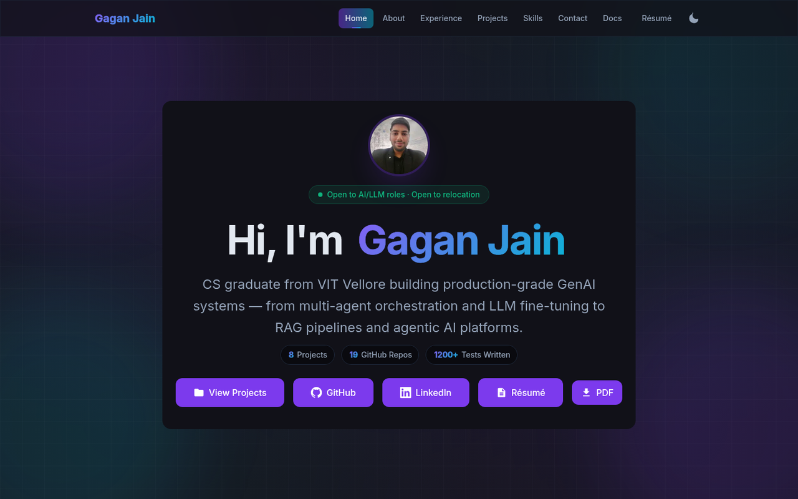
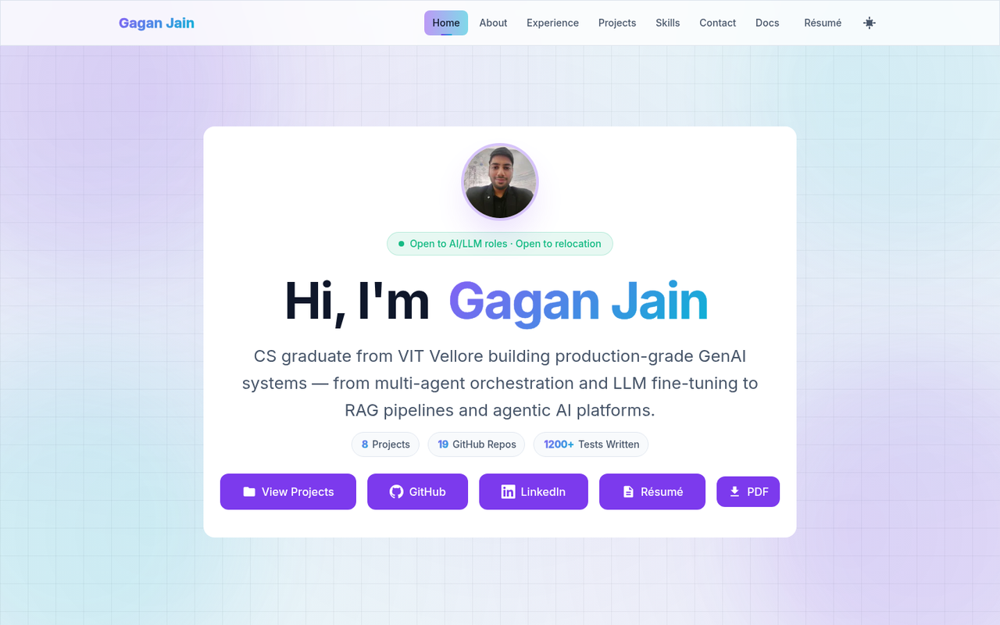
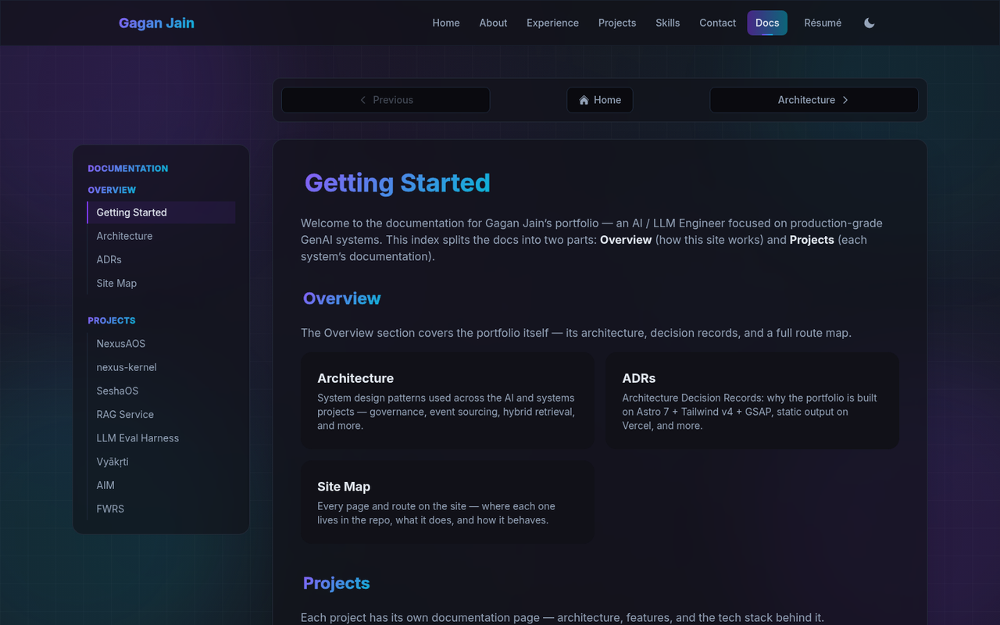
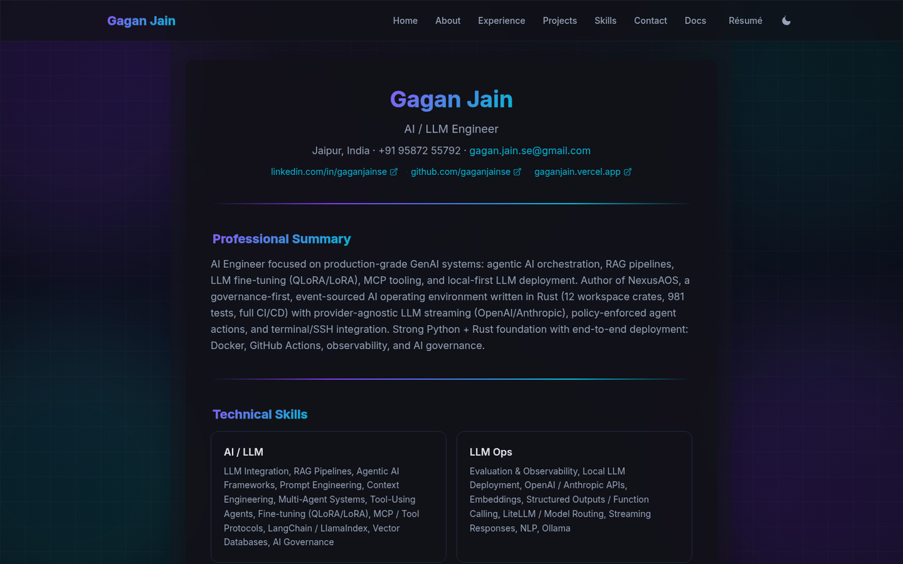
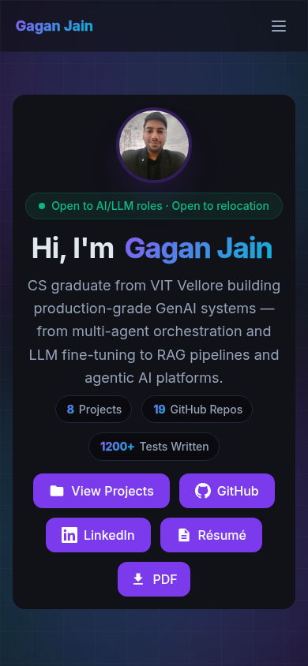

# Portfolio — Gagan Jain

<p align="center">
  
</p>

     

Personal portfolio website of **Gagan Jain** — AI / LLM Engineer. Built with [Astro 7](https://astro.build), [Tailwind CSS v4](https://tailwindcss.com), and [GSAP](https://gsap.com). Focused on production-grade GenAI systems: multi-agent orchestration, LLM fine-tuning, RAG pipelines, agentic AI platforms, and AI governance.

**Live:** [gaganjain.vercel.app](https://gaganjain.vercel.app)

## 📸 Screenshots

<p align="center">
  
  
</p>

<p align="center">
  
  
</p>

<p align="center">
  
</p>

## ✨ Features

- **Dark / Light mode** — toggle in the nav; follows the OS preference by default and persists your choice in `localStorage` (no flash-of-wrong-theme)
- **Data-driven web résumé** — `/resume` is generated from the same data files as the site (`src/data/`), so it can't drift; `resume.pdf` is built from the standalone `public/resume.html` (kept in sync) so both stay current
- **Vercel Web Analytics + Speed Insights** — privacy-friendly analytics and performance monitoring via `@vercel/analytics` and `@vercel/speed-insights`
- **Hybrid-retrieval RAG service** — dense + BM25 keyword search fused with Reciprocal Rank Fusion (see [rag-service](https://github.com/gaganjainse/rag-service))
- **LLM evaluation harness** — golden-set metrics with LLM-as-judge and offline fallbacks (see [llm-eval-harness](https://github.com/gaganjainse/llm-eval-harness))
- **Accessible** — skip link, focus-trapped mobile menu, ARIA-labelled sections, `prefers-reduced-motion` support
- **Fast by default** — static output, optimized images (WebP), gzip-friendly payloads, no analytics on non-Vercel hosts

## About

CS @ VIT Vellore (Graduated 2025, CGPA 7.7/10). I build practical AI systems: LLM-powered apps, RAG pipelines, autonomous agents, and production-ready GenAI platforms. Strong Python + Rust foundation with end-to-end deployment experience.

### AI / LLM Projects

- **SheshAOS** — Governance-first, event-sourced AI operating environment in Rust (9 workspace crates + CLI, 877+ tests)
- **shesh-ecosystem** — Federated, local-first AI body (Brain + Mind + Soma) for CachyOS/Hyprland
- **shesh-omniroute** — Shesh wrapper for OmniRoute — free open-source AI gateway (291 providers, 500+ models)
- **RAG Service** — Production RAG API: hybrid retrieval (dense + BM25, RRF) over ChromaDB
- **LLM Eval Harness** — Golden-set evaluation: faithfulness, answer relevance, correctness

### Other Projects

- **Vyākṛti** — Sanskrit-oriented programming language with complete compiler pipeline and browser IDE
- **AIM** — Production-grade attendance system with Argon2id auth, Prometheus monitoring, and 101 tests
- **FWRS** — Food waste optimization platform using linear programming

Looking for **GenAI / LLM Engineer**, **Agentic AI Engineer**, or **AI Engineer** roles. Based in Jaipur, Rajasthan, India and open to relocation.

## 🚀 Quick Start

Requires **Node.js 24** (see `engines` in `package.json`; CI and Vercel both run Node 24).

```bash
npm install
npm run dev          # Development server
npm run build        # Production build
npm run preview      # Preview production build
npm test             # Unit tests (vitest)
npm run check        # Type-check (astro check)
npm run lint         # ESLint
npm run format       # Prettier (write)
npm run format:check # Prettier (verify)
npm run resume:pdf   # Regenerate public/resume.pdf from public/resume.html (puppeteer)
```

### Regenerating assets

```bash
python3 scripts/generate-favicons.py   # favicon PNGs + ICO + apple-touch-icon (needs PIL + Inter TTFs)
python3 scripts/generate-og-image.py   # public/og-image.png — the 1200×630 social card
npm run resume:pdf                     # public/resume.pdf from public/resume.html
```

The Python generators take `FONT_DIR` and `OUT_DIR` env vars and default to `~/.fonts` / `~/.local/share/fonts` and the repo's `public/` folder, so they work on any machine.

## 🛠️ Tech Stack

| Layer | Tools |
| --- | --- |
| **Framework** | Astro 7.2.0 (static output) |
| **Content** | MDX |
| **Styling** | Tailwind CSS v4.3 |
| **Animations** | GSAP + ScrollTrigger |
| **Analytics** | `@vercel/analytics` + `@vercel/speed-insights` (Vercel Web Analytics & Speed Insights) |
| **Integrations** | `@astrojs/mdx`, `@astrojs/sitemap`, `@astrojs/vercel`, `@vercel/analytics`, `@vercel/speed-insights` |
| **Deployment** | Vercel (static, with 301 redirects via `vercel.json`) |

## 📁 Project Structure

```
src/
├── components/
│   └── sections/        # Page sections (Hero, About, Skills, Projects, Contact)
├── layouts/              # BaseLayout (theme boot, nav, footer, analytics) + DocsLayout
├── pages/                # File-based routing (/, /resume, /404, /docs — incl. Site Map)
├── styles/               # Global CSS + Tailwind v4 theme tokens
├── data/                 # Single-source data (config, projects, skills, experience) + tests
└── utils/                # GSAP + DOM helpers (reduced-motion, scroll progress)
public/                   # Static assets (favicon.svg + PNG favicons, og-image, resume, robots.txt, llms.txt)
screenshots/              # README/social screenshots (incl. og-image.png for the GitHub social preview)
scripts/                  # Generators (favicons, OG image, résumé PDF) + audits (dist, final, glow)
.github/workflows/        # CI (build + test + check + lint + format)
```

## 🧪 Verification

The audit scripts run against the built site (serve it first) and exit non-zero on any failure:

```bash
npm run build
python3 -m http.server 4321 --directory dist   # serve the built site
node scripts/audit-dist.mjs                    # static dist checks (files, links, sitemap, meta, patterns)
BASE_URL=http://localhost:4321 node scripts/audit-final.mjs   # every page: console, requests, meta, axe
BASE_URL=http://localhost:4321 node scripts/verify-glow.mjs   # hover glow on every card
```

The GitHub Actions CI workflow runs `check`, `lint`, `format:check`, `test`, and `build` on every push/PR.

## 📄 Résumé

Résumé is available at [`/resume`](https://gaganjain.vercel.app/resume) and as a PDF at [`/resume.pdf`](https://gaganjain.vercel.app/resume.pdf). The old `/résumé` URLs redirect with a 301.

The web résumé is generated from the same data files as the site (`src/data/skills.ts`, `src/data/experience.ts`, `src/data/projects.ts`), so it can't drift. The PDF is rendered from the standalone `public/resume.html` (A4, no header/footer) which mirrors the web résumé:

```bash
npm run resume:pdf
```

## 🧪 Tests

```bash
npm test
```

Vitest unit tests cover the data layer (`src/data/*.test.ts`): skill categorization (including the balanced AI/LLM + LLM Ops split), proficiency labels, project integrity, companion-project attribution, experience data, and test counts.

## 🧭 Documentation

- [Getting Started](/docs/getting-started) — project index
- [Architecture](/docs/architecture) — system design patterns
- [ADRs](/docs/adr) — architecture decision records
- [Site Map](/docs/site-map) — every page and route in the repo
- [RAG Service](/docs/projects/rag-service) · [LLM Eval Harness](/docs/projects/llm-eval-harness) · [SheshAOS](/docs/projects/sheshaos) · [shesh-ecosystem](/docs/projects/shesh-ecosystem) · [shesh-omniroute](/docs/projects/shesh-omniroute) · [Vyākṛti](/docs/projects/vyakrti)

## 🌐 Live Site

[https://gaganjain.vercel.app](https://gaganjain.vercel.app)

## 📄 License

[GPL-3.0-or-later](./LICENSE) — Copyright © 2026 Gagan Jain

## 📚 Docs

Fleet-wide reading compilation: [shesh-docs](https://github.com/gaganjainse/shesh-docs).
